# Мой учебный проект

## Description
Это программа на C, которая выводит информацию о студенте и контрольной работе. Проект создан для изучения Git.

> Проект создан для освоения Git и работы с ветками

**Задачи проекта:**
- Вывод информации о студенте
- Изучение Git веток
- Создание README документации

## Installation
1. Клонировать репозиторий
2. Установить компилятор GCC
3. Скомпилировать программу

| Версия | Поддержка |
|--------|-----------|
| 1.0.0 | Да |
| 0.9.9 | Нет |
| 0.8.8 | Нет |

## Usage
Программа выводит информацию о студенте.

Для компиляции:

Для запуска:

**Важно:** Перед запуском **обязательно** скомпилируйте программу.  
*Для компиляции требуется GCC.*

| Команда | Описание |
|---------|----------|
| git init | Создание репозитория |
| git add | Добавление файлов |
| git commit | Сохранение изменений |

## Contributing
- Создавайте ветки для новых задач
- Пишите понятные сообщения коммитов
- Тестируйте код перед отправкой

## License
MIT License

## Contact
[Написать автору](mailto:author@example.com)  
[Исходный код на GitHub](https://github.com/AtayewToyli/my-project-Atayew-Toyli)

---

# Отчет по контрольной работе
# Отчет по контрольной работе

## Задача 1
Создал ветку feature/project-title

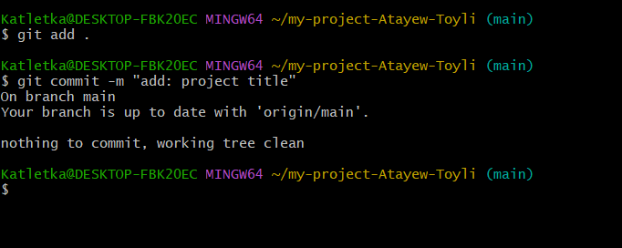

## Задача 2
Создал ветку feature/project

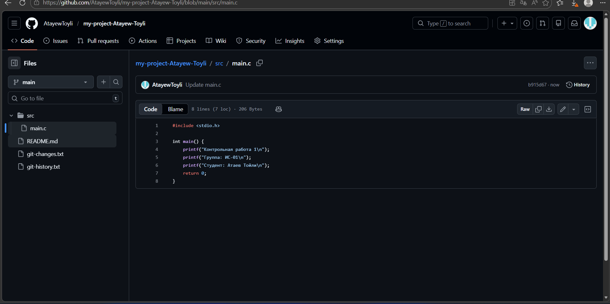

## Задача 3
Создал ветку feature/description

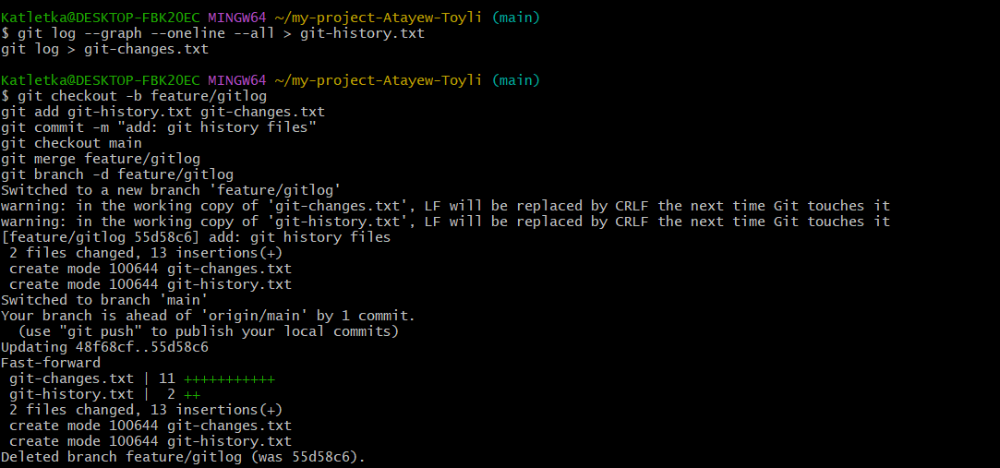

## Задача 4
Создал ветку feature/installation

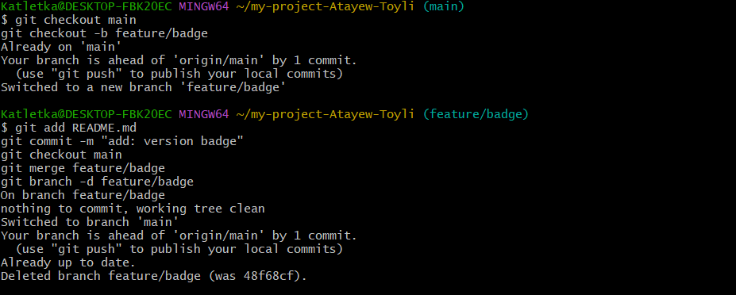

## Задача 5
Создал ветку feature/usage

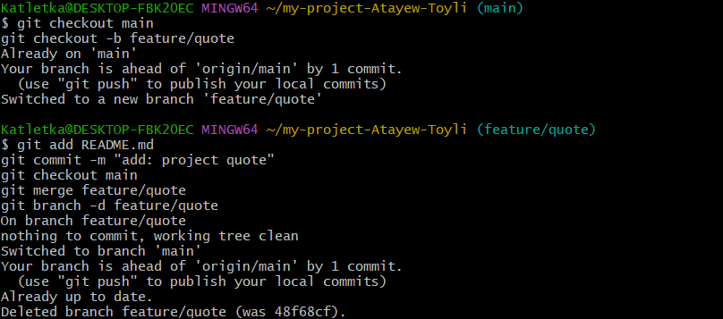

## Задача 6
Создал ветку feature/contributing

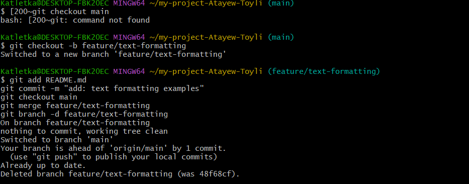

## Задача 7
Создал ветку feature/license

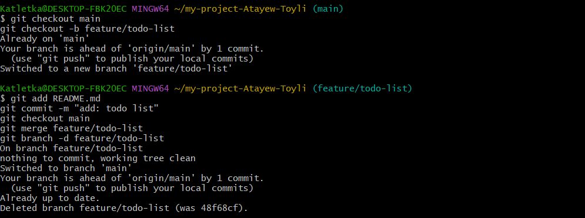

## Задача 8
Создал ветку feature/contact

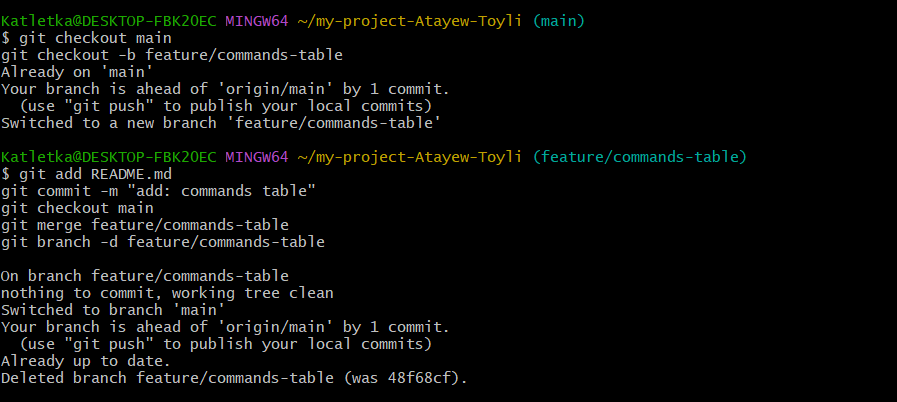

## Задача 9
Создал ветку feature/repo-link

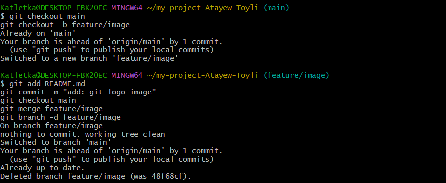

## Задача 10
Создал ветку feature/image

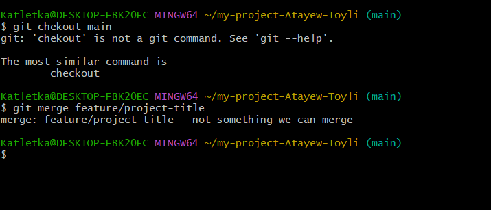

## Задача 11
Создал ветку feature/commands-table

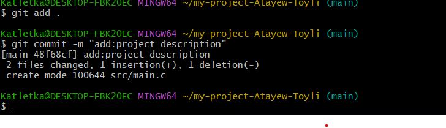

## Задача 12
Создал ветку feature/versions-table

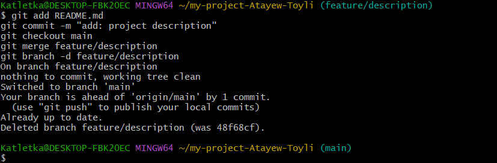

## Задача 13
Создал ветку feature/todo-list

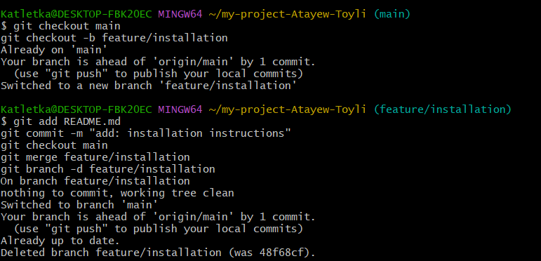

## Задача 14
Создал ветку feature/text-formatting

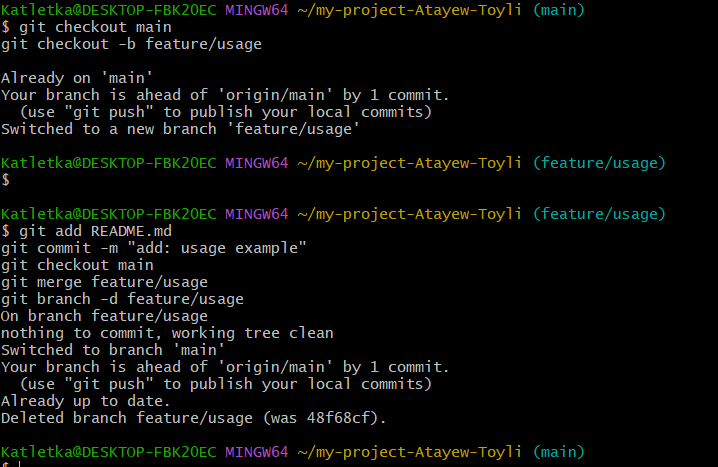

## Задача 15
Создал ветку feature/quote

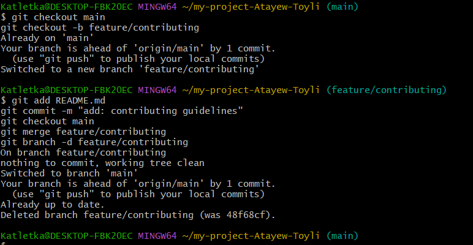

## Задача 16
Создал ветку feature/badge

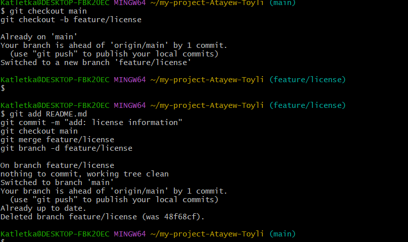

## Задача 17
Создал файлы git-history.txt и git-changes.txt

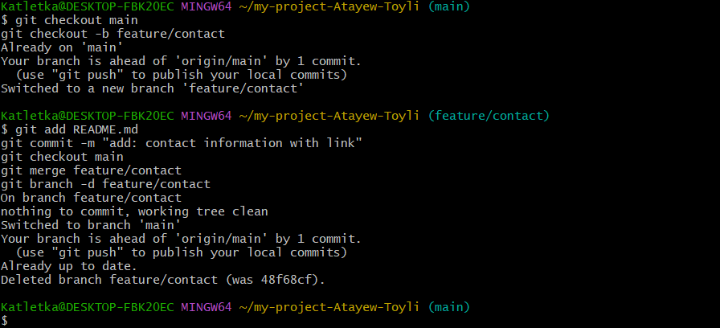
